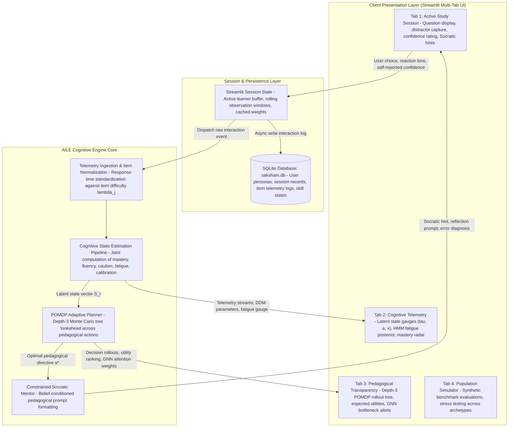
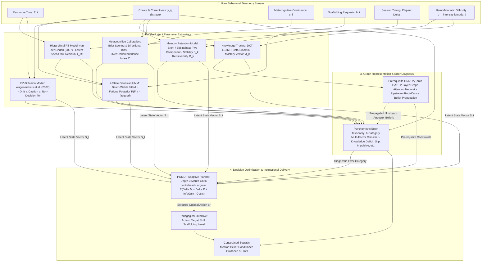

# Saksham — Adaptive Learning Intelligence Engine (AILE)
## An Intelligent Study Mentor Built on Psychometrics, Cognitive Science & Adaptive State Estimation

> *"A student's score is an observation; it is not the student's state."*

---

## 1. Executive Summary & The Problem

Conventional educational software personalizes by assigning students to static "learning style" buckets or recommending generic chapters based on a raw percentage score. 

Consider two students who both score **70%** on a linear and quadratic algebra module:
- **Student A:** Answers rapidly, solves difficult transfer problems correctly, retains material over 7 days, but makes occasional careless slips under fast pacing.
- **Student B:** Takes 4× longer, relies heavily on hints, memorizes steps for immediate testing but forgets after 48 hours, and repeatedly fails due to an unmastered prerequisite in negative integer subtraction.

Prescribing both students *"Review Chapter 4 for 45 minutes"* is personalization in name only.
- **Student A** needs: *"Advance to synthesis; introduce non-standard challenge problems with verification friction."*
- **Student B** needs: *"Repair prerequisite integer rules &rarr; deliberate practice &rarr; spaced retrieval tomorrow &rarr; return to quadratics."*

**Saksham / AILE** does not assign learners to fixed personality archetypes. Instead, it **continuously estimates a probabilistic latent learning state from behavioral telemetry after every interaction** and optimizes the next best pedagogical action.

---

## 2. Core Thesis: Continuous State Estimation vs. Static Classification

Traditional educational claims often rely on fixed, non-empirically supported categorizations (e.g., "visual vs. auditory learners", Pashler et al., 2009). Saksham treats learner attributes as **continuous, probabilistic, time-varying variables**:

$$\mathbf{S}_t = \left[ M_1, \dots, M_K, \; S_1, \dots, S_K, \; \tau, \; a, \; F_t, \; C, \; U \right]$$

| Parameter | Interpretation | Mathematical / Algorithmic Foundation |
|---|---|---|
| **$M_k$** | **Mastery of Knowledge Component $k$** | Item Response Theory (2PL) & Bayesian Beta-Binomial updating for cold start ($N < 5$), smoothly dispatching to **Deep Knowledge Tracing (DKT LSTM)**. |
| **$S_k$** | **Memory Stability of Component $k$** | Ebbinghaus / Bjork two-component retention model: $R_k(\Delta t) = \exp(-\Delta t / S_k)$. Distinguishes immediate recall from durable retention. |
| **$\tau$** | **Processing Speed Parameter** | van der Linden (2007) Hierarchical Response-Time Model: $\log T_{ij} \sim \mathcal{N}(\lambda_j - \tau_i, \sigma^2)$. Normalizes response times against item time-intensity $\lambda_j$. |
| **$a$** | **Response Caution / Decision Boundary** | Closed-form **EZ-Diffusion Model** (Wagenmakers et al., 2007). Quantifies how much evidence a student accumulates before committing (impulsive vs. deliberate). |
| **$F_t$** | **Cognitive Attention / Fatigue State** | 2-State Gaussian **Hidden Markov Model (HMM)** over rolling feature windows $[\text{accuracy}, z_{\text{RT}}, \text{hint\_rate}]$ to infer posterior probability $P(F_t = \text{fatigued})$. |
| **$C$** | **Metacognitive Calibration Error** | Brier score & directional bias: $C = \lvert \text{Confidence} - \text{Actual Outcome} \rvert$. Distinguishes well-calibrated students from overconfident or underconfident learners. |
| **$U$** | **Estimate Uncertainty** | Posterior variance over skill masteries $\sigma^2_k$, guiding informational exploration. |

---

## 3. System Architecture & Workflows

Saksham / AILE is architected around two complementary workflows:
1. **The Overall Application Flow:** End-to-end data lifecycle connecting user interactions in Streamlit, session state buffers, persistent SQLite storage, cognitive engine dispatch, and real-time UI synchronization.
2. **The Internal AI Pipeline:** The mathematical and algorithmic processing pipeline that ingests raw telemetry, computes latent psychometric parameters in parallel, traverses the prerequisite graph with a GNN, classifies cognitive errors, and executes Depth-3 POMDP lookahead planning.

---

### 3.1. Overall Application Flow Architecture

The following diagram illustrates how student actions flow through the user interface, session state managers, database persistence, and back to the front-end telemetry visualizations:



---

### 3.2. Internal AI Engine Pipeline Architecture

The internal AI engine executes a strictly decoupled, multi-stage probabilistic pipeline after every student interaction:



---

### 3.3. Key Pipeline Stage Breakdown

| Stage | Module | Input Telemetry | Theoretical / Mathematical Engine | Primary Output / Latent State |
|---|---|---|---|---|
| **1. Ingestion** | `speed_caution.py` | $T_{ij}$, item difficulty $b_j$ | van der Linden (2007) Hierarchical RT Model: $\log T_{ij} \sim \mathcal{N}(\lambda_j - \tau_i, \sigma_j^2)$ | Latent speed parameter $\tau_i$, log-RT residual $z_{\text{RT}}$ |
| **2. Fluency & Caution** | `ddm_ez.py` | Accuracy $y_{ij}$, latency $T_{ij}$ | Closed-form EZ-Diffusion (Wagenmakers et al., 2007) | Drift rate $v$ (evidence accumulation), boundary $a$ (caution), $T_{\text{er}}$ (non-decision time) |
| **3. Attention / Fatigue** | `attention_hmm.py` | Rolling $[\text{acc}, z_{\text{RT}}, \text{hints}]$ | 2-State Gaussian Hidden Markov Model with transition matrix $\mathbf{A}$ | Posterior state probability $P(F_t = \text{fatigued})$ |
| **4. Knowledge Tracing** | `mastery_dkt.py`, `mastery.py` | Interaction history sequence | Deep Knowledge Tracing (LSTM) + Bayesian Beta-Binomial prior ($N < 5$) | Continuous skill mastery vector $\mathbf{M}_t \in [0, 1]^K$ |
| **5. Memory Decay** | `memory.py` | Elapsed time $\Delta t$, past outcomes | Bjork / Ebbinghaus two-component model: $R_k(\Delta t) = \exp(-\Delta t / S_k)$ | Memory stability $S_k$, current retrievability $R_k$ |
| **6. Metacognition** | `calibration.py` | Confidence rating $c_{ij}$, outcome $y_{ij}$ | Brier quadratic scoring & signed directional bias | Calibration error $C$, overconfidence vs. underconfidence index |
| **7. Prerequisite Graph** | `skill_gnn.py` | $\mathbf{M}_t$ + 9-skill curriculum DAG | 2-layer Graph Attention Network (GAT) with residual skip connections | Upstream root-cause bottleneck isolation |
| **8. Error Taxonomy** | `error_taxonomy.py` | Telemetry + GNN beliefs + distractor | 6-category learning-science classification rules | Category: *Knowledge Deficit*, *Retrieval Failure*, *Procedural*, *Slip*, *Impulsive*, *Overload* |
| **9. Policy Optimization** | `policy_pomdp.py` | Full latent vector $\mathbf{S}_t$, candidate actions | Depth-3 Monte Carlo tree search over multi-objective educational utility | Optimal pedagogical action $a^* \in \mathcal{A}$ |
| **10. Socratic Delivery** | `llm_generator.py` | Action directive $a^*$, error diagnosis | Structured belief-conditioned Socratic generator | Pedagogical hint, misconception diagnosis, reflection prompt |

> **Critical Architecture Principle:** *The LLM is NOT the brain of the system.* The psychometric student model is the brain. The adaptive policy decides *what* needs to happen pedagogically; the LLM is solely a constrained pedagogical communication layer executing that structured directive.

---

## 4. Key Scientific Modules

### 4.1. Prerequisite Knowledge Graph & Root-Cause Personalization
Knowledge is structured as a Directed Acyclic Graph (DAG) across foundational and advanced skills. When a student fails a complex task (e.g., Quadratic Equations), Saksham does not simply conclude the student fails quadratics. It executes **Graph Neural Network (GNN)** message passing across prerequisite edges to isolate the upstream root cause (e.g., negative integer arithmetic rules).

### 4.2. Speed $\neq$ Intelligence (Hierarchical Response-Time Modeling)
Raw latency is misleading: taking 30 seconds on a complex factoring problem is fast, while taking 12 seconds on single-digit addition is slow. 
Saksham normalizes response time against item intensity $\lambda_j$ derived from question difficulty $b_j$:

$$\log T_{ij} \sim \mathcal{N}(\lambda_j - \tau_i, \sigma_j^2)$$

This ensures deliberate, high-mastery students are never penalized for careful reasoning (**Slow $\neq$ Weak**).

### 4.3. Drift-Diffusion Model (DDM) of Decision Caution
Using the closed-form EZ-diffusion equations (Wagenmakers et al., 2007), Saksham estimates:
- **Drift Rate ($v$):** Cognitive evidence accumulation rate (true fluency independent of raw speed).
- **Boundary Separation ($a$):** Decision threshold (identifies impulsive guessing vs. deliberate verification).
- **Non-Decision Time ($T_{\text{er}}$):** Sensory perception and motor execution time.

### 4.4. First-Class Scientific Error Taxonomy
Saksham replaces generic *"Incorrect. Try again"* feedback with six psychometrically grounded error categories:
1. **Knowledge Deficit:** Concept genuinely not acquired; foundational prerequisite gap.
2. **Retrieval Failure:** Previously mastered, but memory decayed over time ($R_k < 0.65$).
3. **Procedural Error:** Concept understood, but intermediate operational steps misapplied.
4. **Careless Slip:** High competence and high retrievability; transient slip under deliberate timing.
5. **Impulsive Error:** Fast sub-threshold response before sufficient evidence accumulation.
6. **Cognitive Overload:** Problem complexity and fatigue exceed working memory capacity.

### 4.5. Memory Stability $\neq$ Instantaneous Mastery
Durable learning requires distinguishing instantaneous performance from retention:
- **Student A:** $M = 0.92, \; S = 2 \text{ days} \implies$ Scheduled for immediate spaced retrieval.
- **Student B:** $M = 0.92, \; S = 30 \text{ days} \implies$ Ready to advance to harder transfer tasks.

### 4.6. Pedagogical Policy Optimization
The optimal next learning action $a^*$ is chosen to maximize multi-objective expected educational utility:

$$a^* = \arg\max_{a} \mathbb{E}\left[ \Delta \text{Mastery} + \Delta \text{Retention} + \text{InfoGain} - \text{TimeCost} - \text{CognitiveLoad} - \text{Frustration} \right]$$

Candidate actions:
$$\mathcal{A} = \{ \text{Advance}, \text{Practice}, \text{Repair Prerequisite}, \text{Spaced Retrieval}, \text{Scaffold Worked Example}, \text{Rest Break} \}$$

Saksham evaluates candidate actions using a **Depth-3 Monte Carlo tree lookahead rollout**, completing forward simulations in **0.50ms** for live real-time interaction.

---

## 5. What Claims to Make vs. What NOT to Claim

| Vulnerable / Unscientific Claim | Defensible Scientific Claim (Used by Saksham) |
|---|---|
| *"Our AI detects if you have ADHD or Autism."* | **"The system detects temporary behavioral attention and fatigue states ($F_t$) via Hidden Markov Models."** |
| *"The AI measures your brainwaves and dopamine."* | **"The system estimates cognitive evidence accumulation and caution parameters using established Drift-Diffusion models."** |
| *"We adapt to your visual/auditory learning style."* | **"We reject debunked static learning styles (Pashler et al., 2009) in favor of continuous cognitive state estimation."** |
| *"Working memory is always exactly 4 chunks."* | **"The system monitors task complexity and scaffolded load sensitivity to prevent cognitive overload."** |
| *"Fast students are smart; slow students are weak."* | **"Slow $\neq$ Weak: Hierarchical response time modeling separates deliberate verification caution from cognitive fluency."** |
| *"Our AI guarantees Bloom's 2-Sigma 98th percentile."* | **"Bloom's 2-Sigma finding highlights the potential of individualization; our AI approximates continuous 1-on-1 diagnostic adaptation."** |

---

## 6. Codebase Structure

```
Saksham Edu4Good/
├── VISION.md                         # Product vision & cognitive modeling stack
├── DECISIONS.md                      # Architecture Decision Records (ADRs 001–006)
├── README.md                         # This comprehensive research & system specification
├── questions.json                    # 9-skill prerequisite DAG with calibrated questions
├── app.py                            # Interactive Streamlit application
│
├── aile/                             # Core Cognitive Engine
│   ├── db.py                         # SQLite persistence with authentic seeded personas
│   ├── skill_graph.py                # Curriculum DAG & PyTorch graph utilities
│   ├── mastery_dkt.py                # Deep Knowledge Tracing LSTM neural network
│   ├── mastery.py                    # Bayesian cold-start -> DKT dispatcher
│   ├── skill_gnn.py                  # 2-layer Graph Attention Network for prerequisite DAG
│   ├── ddm_ez.py                     # Closed-form EZ-Diffusion Model (v, a, Ter, MDT)
│   ├── speed_caution.py              # Item-normalized hierarchical response-time analyzer
│   ├── error_taxonomy.py             # 6-category learning-science error classifier
│   ├── attention_hmm.py              # 2-state Gaussian HMM for cognitive fatigue tracking
│   ├── memory.py                     # Two-component retrievability & decay model
│   ├── calibration.py                # Metacognitive calibration & Brier scoring
│   ├── simulator.py                  # Synthetic student population & transition model
│   ├── policy.py                     # Pedagogical utility scoring functions
│   ├── policy_pomdp.py               # Depth-3 Monte Carlo tree lookahead planner
│   └── llm_generator.py              # Belief-conditioned Socratic mentor generator
│
├── training/                         # Offline Training Pipelines
│   ├── generate_corpus.py            # Synthesizes multi-session learning trajectories
│   ├── train_dkt.py                  # Trains DKT LSTM on sequence corpus
│   ├── train_gnn.py                  # Trains GNN on prerequisite propagation states
│   └── train_hmm.py                  # Fits 2-state Gaussian HMM on fatigue emissions
│
├── models/                           # Serialized Pre-Trained Weights
│   ├── dkt.pt                        # Exported PyTorch DKT weights
│   ├── gnn.pt                        # Exported PyTorch GNN weights
│   └── hmm.pkl                       # Serialized Gaussian HMM artifact
│
├── notebooks/                        # Psychometric & Algorithmic Diagnostics
│   └── run_diagnostics.py            # End-to-end benchmark suite
│
└── tests/
    └── test_cognitive_modules.py     # 9 unit tests covering all mathematical models
```

---

## 7. Quickstart & Verification

### 1. Installation
```bash
python3 -m venv .venv
source .venv/bin/activate
pip install -r requirements.txt
```

### 2. Run Test Suite
```bash
pytest tests/
```
*Validates EZ-diffusion parameter recovery, hierarchical response-time modeling, GNN root-cause identification, 6-category error classification, memory decay, calibration, and DKT LSTM forward passes.*

### 3. Run Diagnostic Benchmarks
```bash
python3 notebooks/run_diagnostics.py
```

### 4. Launch Interactive Application
```bash
streamlit run app.py
```
Open `http://localhost:8501` to test:
- **Active Study Session:** Answer items, provide metacognitive confidence ratings, inspect misconception rationales, and observe automated error diagnosis.
- **Cognitive Telemetry:** View continuous latent state vector $\mathbf{S}_t$, DDM caution ($a$), drift rate ($v$), speed parameter ($\tau$), and fatigue probability ($F_t$).
- **Pedagogical Transparency ("Why this action?"):** Inspect the 3-step POMDP Monte Carlo tree, branch utilities, and GNN prerequisite graph attention weights.
- **Simulator & Benchmarking:** Benchmark against 4 distinct synthetic learner profiles.

---

## 8. Selected Scientific References

1. **Learning Styles Critique:** Pashler, H., McDaniel, M., Rohrer, D., & Bjork, R. (2009). *Learning Styles: Concepts and Evidence*. Psychological Science in the Public Interest. [DOI: 10.1111/j.1539-6053.2009.01038.x](https://doi.org/10.1111/j.1539-6053.2009.01038.x)
2. **Hierarchical Response Time Modeling:** van der Linden, W. J. (2007). *A hierarchical framework for modeling speed and accuracy on test items*. Psychometrika, 72(3), 287–308.
3. **EZ-Diffusion Model:** Wagenmakers, E. J., van der Maas, H. L., & Grasman, R. P. (2007). *An EZ-diffusion model for response time and accuracy*. Psychonomic Bulletin & Review, 14(1), 3–22.
4. **Retrieval Practice & Testing Effects:** Roediger, H. L., & Karpicke, J. D. (2006). *The power of testing memory: Basic research and implications for educational practice*. Perspectives on Psychological Science, 1(3), 181–210.
5. **Distributed Practice & Spacing:** Cepeda, N. J., Pashler, H., Vul, E., Wixted, J. T., & Rohrer, D. (2006). *Distributed practice in verbal recall tasks: A review and quantitative synthesis*. Psychological Bulletin, 132(3), 354–380.
6. **POMDP Teaching Planning:** Rafferty, A. N., Brunskill, E., Griffiths, T. L., & Shafto, P. (2011). *Faster Teaching by POMDP Planning*. Cognitive Science Society.
7. **Intelligent Tutoring Meta-Analysis:** Kulik, J. A., & Fletcher, J. D. (2016). *Effectiveness of intelligent tutoring systems: A meta-analytic review*. Review of Educational Research, 86(1), 42–78.
8. **Bloom's 2-Sigma Problem:** Bloom, B. S. (1984). *The 2 sigma problem: The search for methods of group instruction as effective as one-to-one tutoring*. Educational Researcher, 13(6), 4–16.
